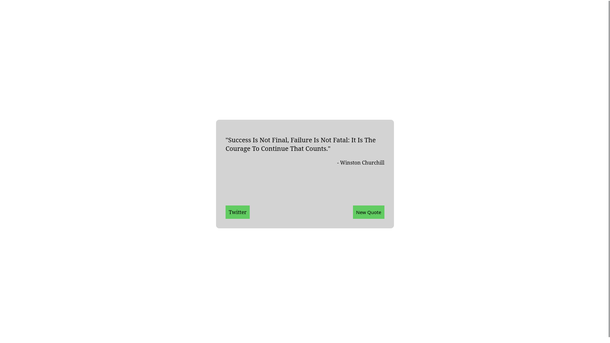
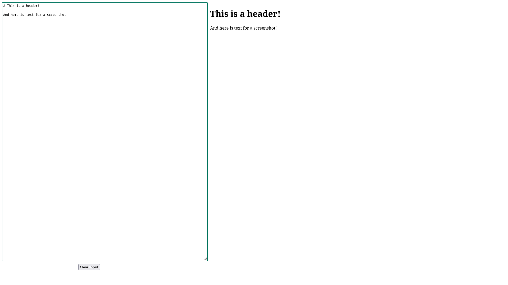
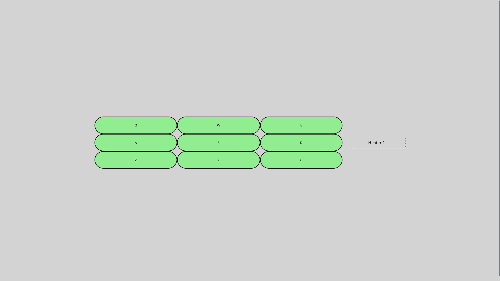
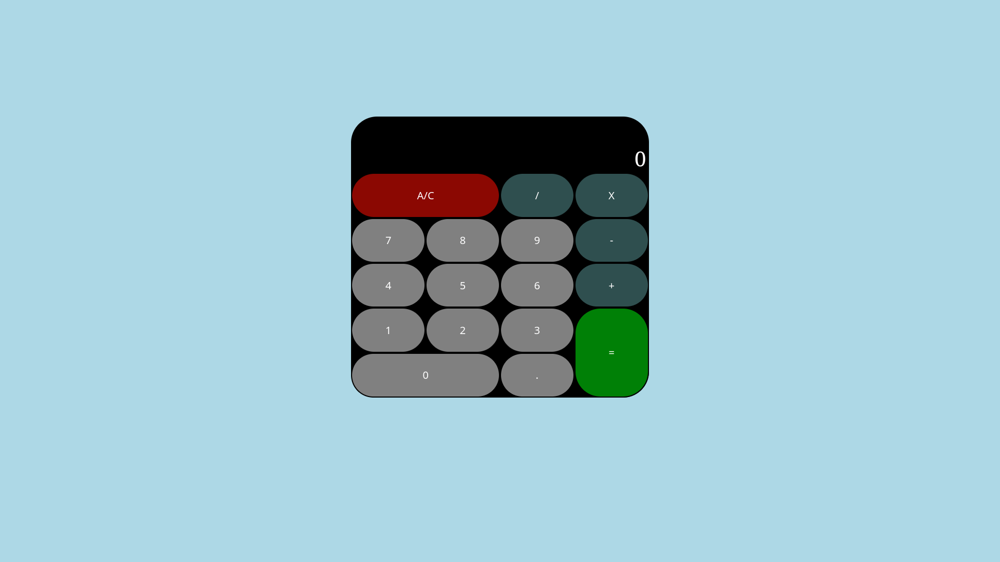
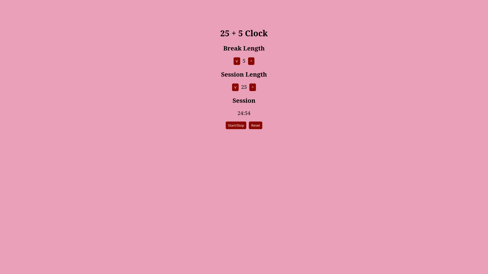

# freeCodeCamp Front End Development Libraries Certificate

These are the projects I did in the completion of this certificate.

[Here](https://www.freecodecamp.org/certification/fcc30aca8b2-d2c4-4009-a397-2e6d1ecbde3b/front-end-development-libraries) is my certificate on freeCodeCamp.

## Projects

### Random Quote Machine

Displays quotes from an API and allows sharing via Twitter.



### Markdown Previewer

Displays Markdown text in a preview pane.



### Drum Machine

Play a selection of drum samples.



### JavaScript Calculator

A basic 4-function calculator.



### 25 + 5 Clock

A countdown timer that cycles between a "Session" and a "Break".



## Skills
- Bootstrap CSS
- jQuery
- React.js

## Development Tools

- [VS Code](https://code.visualstudio.com/) - Development environment
- [Node.js](https://nodejs.org/en/) - JavaScript runtime environment
- [Vite](https://vite.dev/) - Build tool for setting up the project structure
- [Git](https://git-scm.com/)/[GitHub](https://github.com/) - Version control

## Running the Projects

Demos for the projects are accessible from the certificate link. At the bottom of the page, click on "View" to go to the CodePen link for the respective project. The projects on this GitHub and on the CodePen submissions are different as CodePen is not using vite (what this repo uses), but the code that I wrote is the same.

It is also possible to clone the repo to run the projects locally. You will need node.js installed. To run a project, navigate to the project folder, open a terminal window, then type ```npm install```, then ```npm run dev```. This will start a local server that can be viewed in a web browser.
